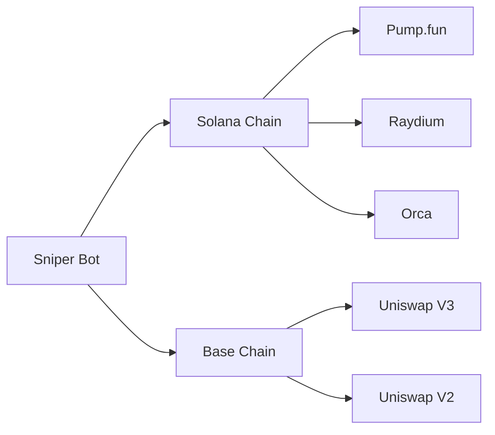
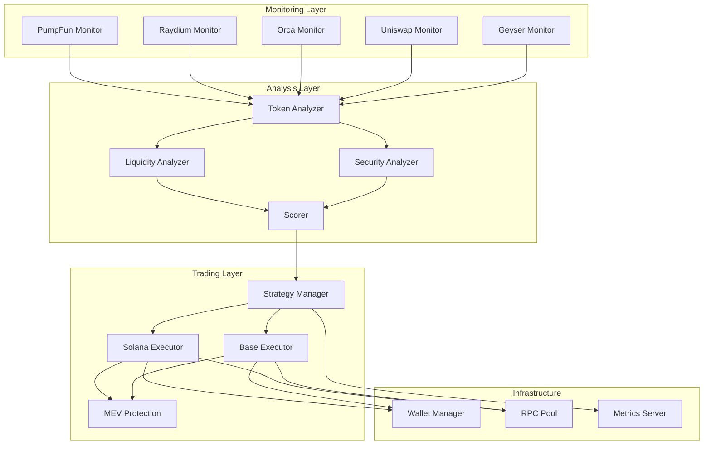
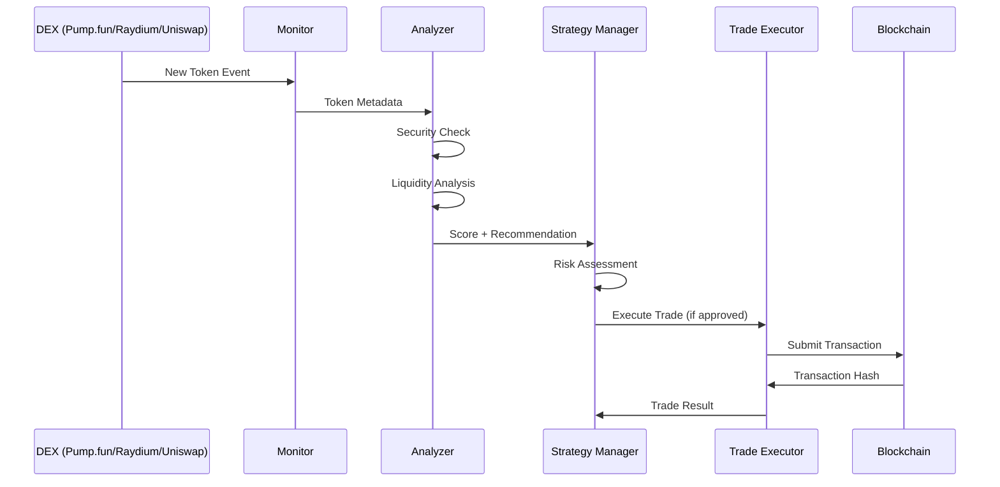
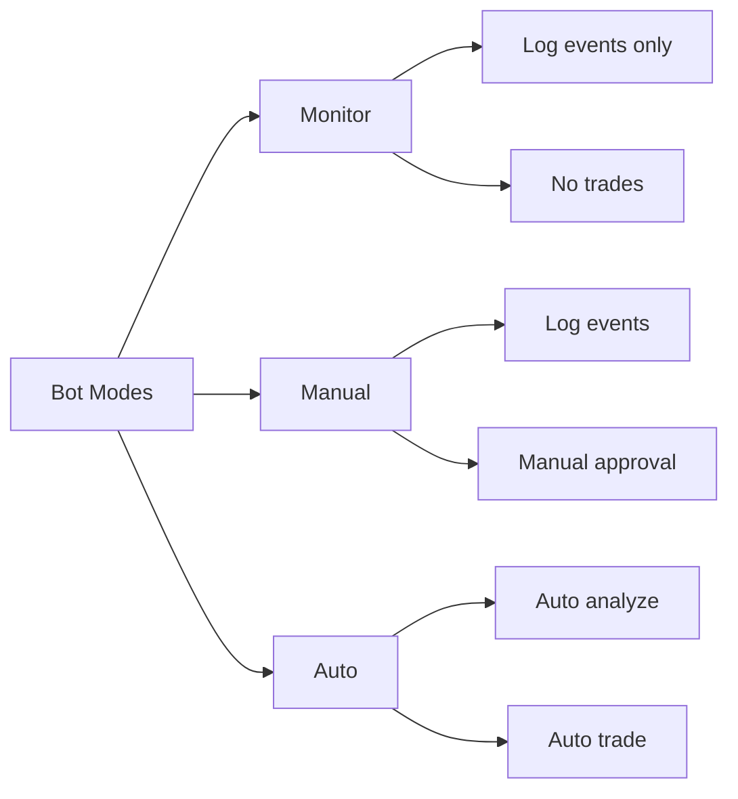

# Meme Coin Sniper Bot

An advanced Golang-based multi-chain meme coin sniper bot for Solana and Base (Ethereum L2).

## Table of Contents

- [Overview](#overview)
- [Features](#features)
- [Architecture](#architecture)
- [Prerequisites](#prerequisites)
- [Installation](#installation)
- [Configuration](#configuration)
- [Usage](#usage)
- [Deployment](#deployment)
- [Troubleshooting](#troubleshooting)
- [Security](#security)
- [Contributing](#contributing)
- [License](#license)

## Overview

This bot monitors multiple DEXs (Pump.fun, Raydium, Orca on Solana; Uniswap on Base) for new token listings, analyzes them for security and profitability, and executes trades automatically with MEV protection.

### What is a Meme Coin Sniper Bot?

A meme coin sniper bot is an automated trading bot that:

1. **Monitors** blockchain events for new token launches
2. **Analyzes** tokens for security risks and profit potential
3. **Executes** trades faster than manual trading
4. **Protects** against MEV (Maximal Extractable Value) attacks

### Key Concepts

| Concept            | Description                                            |
| ------------------ | ------------------------------------------------------ |
| **Sniping**        | Buying tokens immediately after liquidity is added     |
| **MEV Protection** | Using private mempools to avoid front-running          |
| **Slippage**       | Price difference between expected and actual execution |
| **Liquidity**      | Amount of assets in a trading pool                     |
| **Rug Pull**       | Malicious act where developers abandon a token         |

## Features

### Multi-Chain Support



### Core Features

| Feature                  | Description                                             |
| ------------------------ | ------------------------------------------------------- |
| **Real-time Monitoring** | WebSocket connections to DEXs for instant detection     |
| **Security Analysis**    | Rug pull detection, honeypot checks, liquidity analysis |
| **MEV Protection**       | Flashbots and Merkle private mempool integration        |
| **Risk Management**      | Take profit, stop loss, position sizing                 |
| **Metrics**              | Prometheus integration for monitoring                   |
| **Multi-wallet Support** | Encrypted key storage for multiple wallets              |

## Architecture

### System Overview



### Data Flow



### Directory Structure

```
bot/
├── cmd/
│   └── sniper/              # CLI entry point
│       └── main.go
├── internal/
│   ├── analyzer/            # Token analysis modules
│   │   ├── liquidity.go     # Liquidity analysis
│   │   ├── security.go      # Security checks
│   │   ├── scorer.go        # Token scoring
│   │   └── token.go         # Metadata fetching
│   ├── app/                 # Bot orchestration
│   │   ├── bot.go           # Main bot logic
│   │   ├── signals.go       # Graceful shutdown
│   │   └── metrics.go       # Prometheus metrics
│   ├── config/              # Configuration management
│   │   └── config.go
│   ├── monitor/             # DEX monitors
│   │   ├── base/            # Base chain monitors
│   │   │   ├── events.go
│   │   │   ├── mempool.go
│   │   │   └── uniswap.go
│   │   └── solana/          # Solana monitors
│   │       ├── geyser.go
│   │       ├── orca.go
│   │       ├── pumpfun.go
│   │       └── raydium.go
│   ├── strategy/            # Trading strategies
│   │   ├── entry_criteria.go
│   │   ├── exit_criteria.go
│   │   ├── manager.go
│   │   └── stop_loss.go
│   ├── trader/              # Trade execution
│   │   ├── executor.go      # Solana trades
│   │   ├── fees.go          # Fee estimation
│   │   ├── gas.go           # Gas management
│   │   ├── jupiter.go       # Jupiter aggregator
│   │   ├── mev.go           # MEV protection
│   │   └── uniswap.go       # Uniswap trades
│   └── wallet/              # Wallet management
│       ├── keychain.go      # Encrypted key storage
│       ├── manager.go       # Wallet operations
│       └── portfolio.go     # Portfolio tracking
├── pkg/
│   ├── rpc/                 # RPC connection pool
│   │   └── pool.go
│   └── util/                # Utilities
│       ├── logger.go
│       └── retry.go
├── tests/
│   └── integration/         # Integration tests
├── config.example.yaml      # Example configuration
├── Dockerfile
├── docker-compose.yml
└── Makefile
```

## Prerequisites

### Required Software

| Software           | Version | Purpose                       |
| ------------------ | ------- | ----------------------------- |
| **Go**             | 1.23+   | Programming language          |
| **Docker**         | 20.10+  | Containerization              |
| **Docker Compose** | 2.20+   | Multi-container orchestration |
| **Git**            | 2.30+   | Version control               |

### Required Accounts

1. **RPC Endpoints**: Get from QuickNode, Alchemy, or Helius
2. **API Keys** (optional):
   - Jupiter API (Solana swaps)
   - Flashbots API (Base MEV protection)

### Hardware Requirements

| Component   | Minimum  | Recommended |
| ----------- | -------- | ----------- |
| **CPU**     | 2 cores  | 4+ cores    |
| **RAM**     | 4 GB     | 8 GB        |
| **Storage** | 20 GB    | 50 GB SSD   |
| **Network** | 100 Mbps | 1 Gbps      |

### Knowledge Requirements

Before using this bot, you should understand:

- Basic command line usage
- Blockchain concepts (wallets, transactions, gas fees)
- Trading basics (orders, slippage, liquidity)
- Risk management (position sizing, stop-loss)

## Installation

### Option 1: Docker (Recommended)

1. **Clone the repository:**

   ```bash
   git clone https://github.com/lilwiggy/bot.git
   cd bot
   ```

2. **Build the Docker image:**

   ```bash
   docker build -t meme-sniper:latest .
   ```

3. **Run with Docker Compose:**
   ```bash
   cp config.example.yaml config.yaml
   # Edit config.yaml with your settings
   docker-compose up -d
   ```

### Option 2: Build from Source

1. **Clone and install dependencies:**

   ```bash
   git clone https://github.com/lilwiggy/bot.git
   cd bot
   go mod download
   ```

2. **Build the binary:**

   ```bash
   make build
   # Or manually:
   go build -o bin/sniper ./cmd/sniper
   ```

3. **Install globally (optional):**
   ```bash
   sudo make install
   ```

### Option 3: Using Make

```bash
# Install all dependencies
make deps

# Run tests
make test

# Build
make build

# Run linter
make lint

# Clean build artifacts
make clean
```

## Configuration

### Configuration File Structure

Create a `config.yaml` file based on `config.example.yaml`:

```yaml
# Bot Configuration
bot:
  name: my-sniper-bot
  dry_run: true # Set to false for live trading
  log_level: info
  max_concurrent_trades: 3

# Chain Configuration
chains:
  solana:
    enabled: true
    network: mainnet # or devnet for testing
    rpc_endpoints:
      - url: https://your-solana-rpc.com
        name: primary
        weight: 100
    priority_fee: 0.0001 # SOL

  base:
    enabled: false # Enable for Base trading
    network: mainnet
    chain_id: 8453
    rpc_endpoints:
      - url: https://your-base-rpc.com
        name: primary
        weight: 100
    gas_price_gwei: 30

# Wallet Configuration
wallets:
  data_dir: ./wallets
  encryption:
    enabled: true
    key_derivation: scrypt

# Monitoring Configuration
monitoring:
  solana:
    pumpfun:
      enabled: true
      websocket_url: wss://pump.fun/ws
    raydium:
      enabled: true
    orca:
      enabled: true
    geyser:
      enabled: false
      endpoint: your-geyser-endpoint

  base:
    uniswap:
      enabled: true
      factory_address: 0x...
      router_address: 0x...
    mempool:
      enabled: true

# Analysis Configuration
analysis:
  min_liquidity_usd: 1000
  min_score: 70
  check_rug_pull: true
  check_honeypot: true
  max_buy_tax: 5 # percentage
  max_sell_tax: 5 # percentage

# Strategy Configuration
strategies:
  mode: auto # auto, manual, monitor
  max_position_size_usd: 100
  take_profit_percent: 50
  stop_loss_percent: 20
  trailing_stop_percent: 10

# MEV Protection
mev:
  solana:
    jupiter_api: https://quote-api.jup.ag
  base:
    provider: flashbots # or merkle
    flashbots_api_key: your-api-key

# Metrics (Optional)
metrics:
  enabled: true
  port: 9090
  endpoint: /metrics
```

### Environment Variables

You can also use environment variables (overrides config file):

```bash
# Bot settings
export SNIPER_DRY_RUN=true
export SNIPER_LOG_LEVEL=info

# RPC endpoints
export SOLANA_RPC_URL=https://your-solana-rpc.com
export BASE_RPC_URL=https://your-base-rpc.com

# Wallet
export WALLET_PASSWORD=your-secure-password

# API Keys
export JUPITER_API_KEY=your-jupiter-key
export FLASHBOTS_API_KEY=your-flashbots-key
```

## Usage

### Basic Commands

```bash
# Show help
sniper --help

# Show version
sniper version

# Start the bot
sniper start

# Start with custom config
sniper start --config /path/to/config.yaml

# Show current configuration
sniper config show
```

### Bot Modes

The bot operates in three modes:



#### 1. Monitor Mode (Safe for testing)

```bash
sniper start --mode monitor
```

- Monitors all events
- Logs token detections
- **Does not execute any trades**

#### 2. Manual Mode

```bash
sniper start --mode manual
```

- Monitors events
- Shows trading opportunities
- Requires manual approval for trades

#### 3. Auto Mode (Live trading)

```bash
sniper start --mode auto
```

- Full automatic trading
- Executes trades based on strategy
- **Use with caution!**

### Wallet Management

```bash
# Create a new wallet
sniper wallet create --chain solana

# List all wallets
sniper wallet list

# Export wallet address (for funding)
sniper wallet export --id <wallet-id> --address-only

# Backup wallet
sniper wallet backup --id <wallet-id> --output backup.json

# Restore wallet
sniper wallet restore --input backup.json
```

### Examples

#### Example 1: Test on Solana Devnet

```bash
# 1. Update config.yaml
chains:
  solana:
    network: devnet
    rpc_endpoints:
      - url: https://api.devnet.solana.com

bot:
  dry_run: true

# 2. Start the bot
sniper start --mode monitor
```

#### Example 2: Live Trading on Solana

```bash
# 1. Create and fund wallet
sniper wallet create --chain solana
# Fund the displayed address with SOL

# 2. Configure strategy
strategies:
  mode: auto
  max_position_size_usd: 50
  take_profit_percent: 100
  stop_loss_percent: 20

# 3. Start trading
sniper start --mode auto
```

#### Example 3: Multi-Chain Trading

```yaml
# Enable both chains
chains:
  solana:
    enabled: true
  base:
    enabled: true

# Configure different strategies per chain
strategies:
  chains:
    solana:
      max_position_size_usd: 100
    base:
      max_position_size_usd: 200
```

## Deployment

### Using Docker Compose (Production)

1. **Create `.env` file:**

   ```bash
   cp .env.example .env
   # Edit with your values
   ```

2. **Start services:**

   ```bash
   docker-compose up -d
   ```

3. **View logs:**

   ```bash
   docker-compose logs -f sniper
   ```

4. **Stop services:**
   ```bash
   docker-compose down
   ```

### Systemd Service (Linux)

1. **Create service file:**

   ```bash
   sudo cp sniper.service /etc/systemd/system/
   ```

2. **Edit service file:**

   ```ini
   [Unit]
   Description=Meme Coin Sniper Bot
   After=network.target

   [Service]
   Type=simple
   User=your-user
   WorkingDirectory=/opt/bot
   ExecStart=/usr/local/bin/sniper start --config /opt/bot/config.yaml
   Restart=always
   RestartSec=10

   [Install]
   WantedBy=multi-user.target
   ```

3. **Enable and start:**

   ```bash
   sudo systemctl daemon-reload
   sudo systemctl enable sniper
   sudo systemctl start sniper
   ```

4. **Check status:**
   ```bash
   sudo systemctl status sniper
   journalctl -u sniper -f
   ```

### Kubernetes Deployment

```yaml
# deployment.yaml
apiVersion: apps/v1
kind: Deployment
metadata:
  name: sniper-bot
spec:
  replicas: 1
  selector:
    matchLabels:
      app: sniper-bot
  template:
    metadata:
      labels:
        app: sniper-bot
    spec:
      containers:
        - name: sniper
          image: meme-sniper:latest
          env:
            - name: SNIPER_DRY_RUN
              value: "false"
            - name: WALLET_PASSWORD
              valueFrom:
                secretKeyRef:
                  name: wallet-secrets
                  key: password
          volumeMounts:
            - name: config
              mountPath: /app/config.yaml
              subPath: config.yaml
            - name: wallets
              mountPath: /app/wallets
      volumes:
        - name: config
          configMap:
            name: sniper-config
        - name: wallets
          persistentVolumeClaim:
            claimName: wallet-storage
```

## Monitoring

### Metrics Endpoint

The bot exposes Prometheus metrics on `http://localhost:9090/metrics`:

```promql
# Trade metrics
sniper_trades_total{chain="solana",dex="pumpfun"}
sniper_trades_success_total
sniper_trades_failed_total

# Monitoring metrics
sniper_events_detected_total
sniper_monitor_up{name="pumpfun",chain="solana"}

# System metrics
sniper_bot_uptime_seconds
sniper_errors_total{component="trader",type="execution"}
```

### Grafana Dashboard

Import the provided dashboard to visualize metrics:

1. Add Prometheus as data source
2. Import `grafana-dashboard.json`
3. View real-time bot performance

## Troubleshooting

### Common Issues

#### 1. "Connection refused" Error

**Problem:** Cannot connect to RPC endpoint

**Solution:**

```bash
# Test RPC endpoint
curl -X POST https://your-rpc.com \
  -H "Content-Type: application/json" \
  -d '{"jsonrpc":"2.0","id":1,"method":"getHealth"}'

# Check firewall settings
# Verify RPC endpoint is accessible
```

#### 2. "Insufficient funds" Error

**Problem:** Wallet doesn't have enough balance

**Solution:**

```bash
# Check wallet balance
sniper wallet list --id <wallet-id>

# Fund wallet with:
# - SOL for trading + fees (0.01 SOL recommended)
# - ETH for Base gas fees
```

#### 3. "Transaction failed" Error

**Problem:** Transaction not submitted

**Solution:**

- Check slippage settings (increase if needed)
- Verify liquidity pool exists
- Check gas/priority fee settings
- Review logs for specific error

#### 4. High CPU Usage

**Problem:** Bot using too much CPU

**Solution:**

```yaml
# Reduce number of monitors
monitoring:
  solana:
    geyser:
      enabled: false  # Disable if not needed
    orca:
      enabled: false

# Reduce polling interval
monitoring:
  poll_interval: 5s  # Increase from default
```

### Debug Mode

Enable debug logging:

```bash
sniper start --log-level debug
```

Or in config:

```yaml
bot:
  log_level: debug
```

### Health Checks

```bash
# Check if bot is running
sniper status

# Check monitor status
curl http://localhost:9090/metrics | grep sniper_monitor_up
```

## Security

### Best Practices

1. **Never commit private keys** to version control
2. **Use strong passwords** for wallet encryption
3. **Enable encryption** for wallet storage
4. **Run in dry-run mode** first
5. **Limit position sizes** when starting
6. **Monitor logs** regularly
7. **Keep software updated**

### Wallet Security

```yaml
# Enable wallet encryption
wallets:
  encryption:
    enabled: true
    algorithm: aes-256-gcm
    key_derivation: scrypt
    scrypt:
      N: 32768
      r: 8
      p: 1
```

### API Key Security

Use environment variables for sensitive data:

```bash
# Never hardcode API keys
export FLASHBOTS_API_KEY=xxx
export JUPITER_API_KEY=xxx
```

### Firewall Rules

```bash
# Only allow outbound connections
iptables -A INPUT -j DROP
iptables -A OUTPUT -j ACCEPT
iptables -A INPUT -m state --state ESTABLISHED,RELATED -j ACCEPT
```

## Risk Disclaimer

**⚠️ IMPORTANT WARNING:**

Trading meme coins carries significant risk:

1. **High Volatility:** Prices can change dramatically in seconds
2. **Rug Pulls:** Developers may abandon projects
3. **Honeypots:** Tokens may be designed to prevent selling
4. **Impermanent Loss:** Liquidity provision can result in losses
5. **Technical Risks:** RPC failures, network congestion, etc.

**Always:**

- Start with small amounts
- Use stop-loss orders
- Never invest more than you can afford to lose
- Do your own research
- Understand the risks

## Advanced Topics

### Custom Strategy

Create a custom strategy by implementing the `Strategy` interface:

```go
type CustomStrategy struct {
    config StrategyConfig
}

func (s *CustomStrategy) Evaluate(event TokenEvent) (Signal, error) {
    // Your custom logic here
    return Signal{
        ShouldTrade: true,
        Action:      SignalTypeBuy,
        Confidence:  0.85,
    }, nil
}
```

### Backtesting

Run historical analysis:

```bash
sniper backtest --start 2024-01-01 --end 2024-01-31
```

### Multiple Bot Instances

Run multiple bots with different strategies:

```bash
# Bot 1 - Conservative
sniper start --config conservative.yaml

# Bot 2 - Aggressive
sniper start --config aggressive.yaml
```

## Contributing

Contributions are welcome! Please:

1. Fork the repository
2. Create a feature branch
3. Write tests for new features
4. Submit a pull request

## License

This project is licensed under the MIT License - see the LICENSE file for details.

## Support

- **Documentation:** [GitHub Wiki](https://github.com/lilwiggy/your-ex/wiki)
- **Issues:** [GitHub Issues](https://github.com/lilwiggy/your-ex/issues)
- **Discussions:** [GitHub Discussions](https://github.com/lilwiggy/your-ex/discussions)

## Acknowledgments

- [Jupiter Aggregator](https://jup.ag) - Solana DEX aggregation
- [Flashbots](https://flashbots.net) - MEV protection
- [Uniswap](https://uniswap.org) - Base DEX
- [Go-Zero](https://github.com/zeromicro/go-zero) - Framework inspiration
