# Architecture Documentation

Deep dive into the bot's internal architecture and design decisions.

## Table of Contents

- [Design Principles](#design-principles)
- [Component Architecture](#component-architecture)
- [Data Flow](#data-flow)
- [Concurrency Model](#concurrency-model)
- [Error Handling](#error-handling)
- [Performance Considerations](#performance-considerations)
- [Security Architecture](#security-architecture)
- [Testing Strategy](#testing-strategy)

## Design Principles

### 1. Separation of Concerns

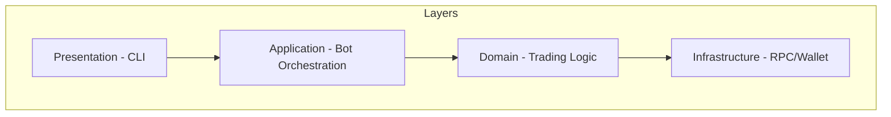

Each layer has specific responsibilities:

- **Presentation**: CLI commands and user interaction
- **Application**: Workflow orchestration
- **Domain**: Business logic (trading, analysis)
- **Infrastructure**: External services (RPC, wallet storage)

### 2. Interface-Based Design

Core components use interfaces for flexibility:

```go
// Monitor interface - all monitors implement this
type Monitor interface {
    SetHandler(handler EventHandler)
    Start() error
    Stop() error
    Status() MonitorStatus
}

// EventHandler interface - handles token events
type EventHandler interface {
    HandleTokenEvent(event *TokenEvent) error
    OnError(err error)
}
```

### 3. Dependency Injection

Components receive dependencies via constructor:

```go
func NewBot(config Config) (*Bot, error) {
    // All dependencies passed in config
    return &Bot{
        walletManager: config.WalletManager,
        monitors:      config.Monitors,
        // ...
    }, nil
}
```

## Component Architecture

### Monitoring Layer

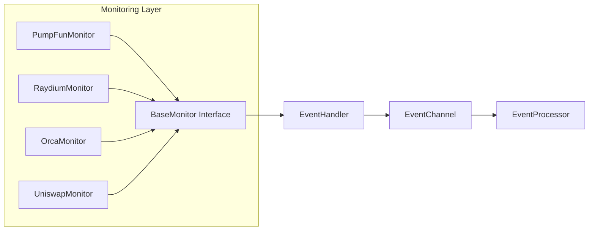

### Monitor Lifecycle

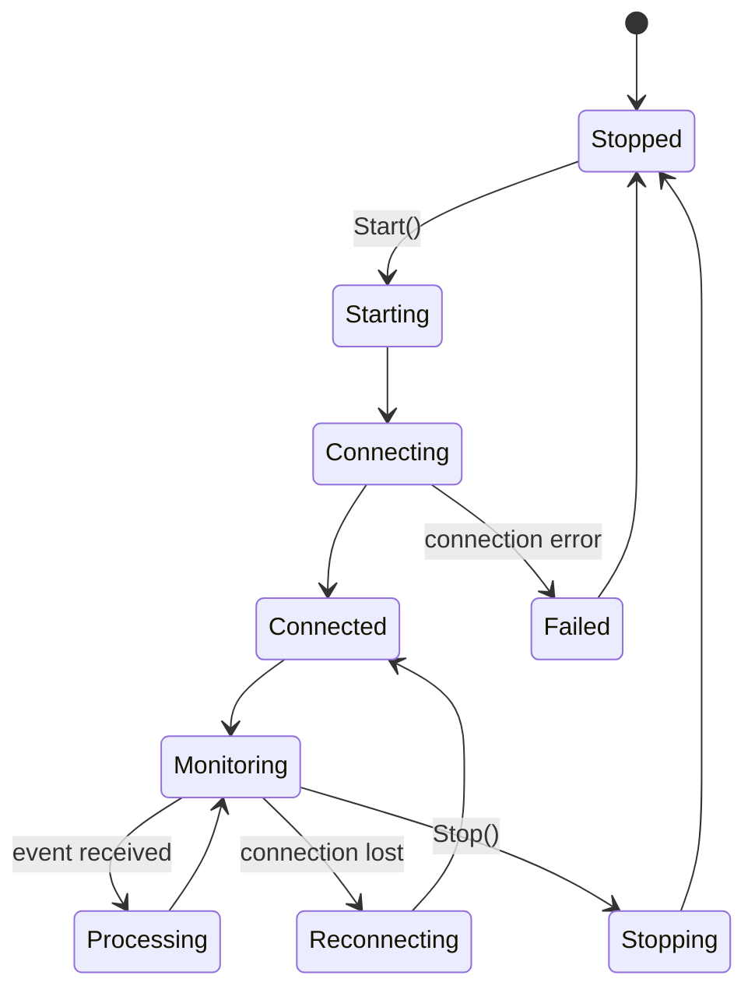

### Analysis Pipeline

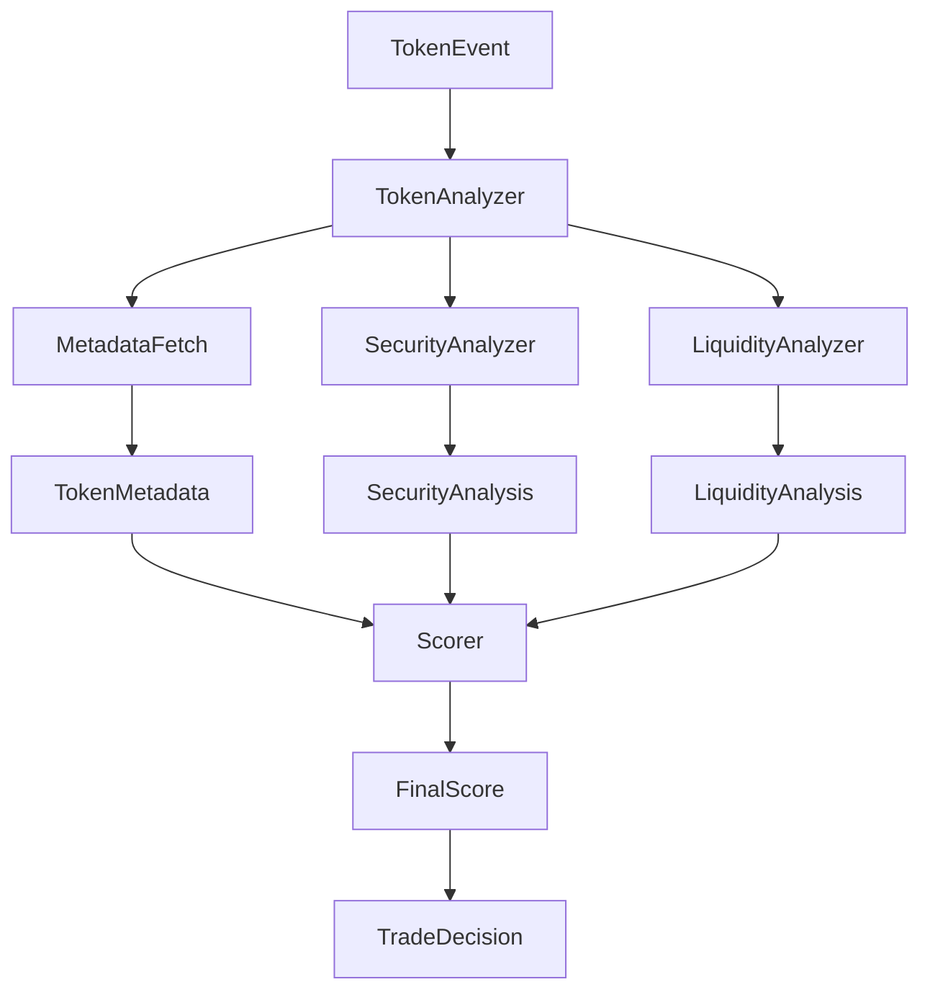

### Trading Layer

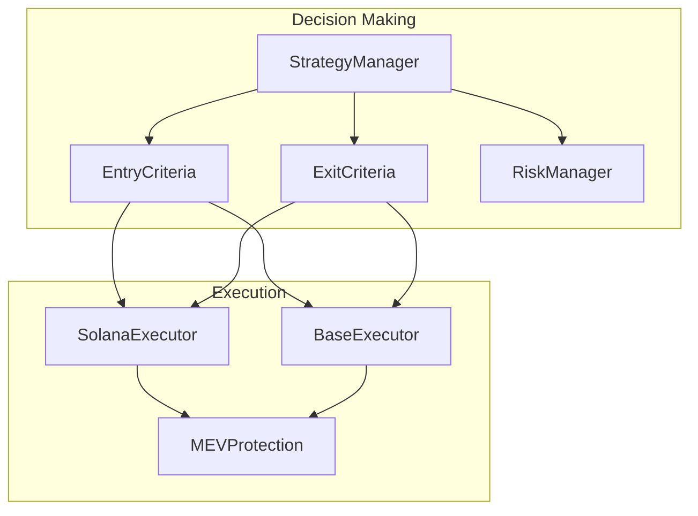

## Data Flow

### Event Processing Flow

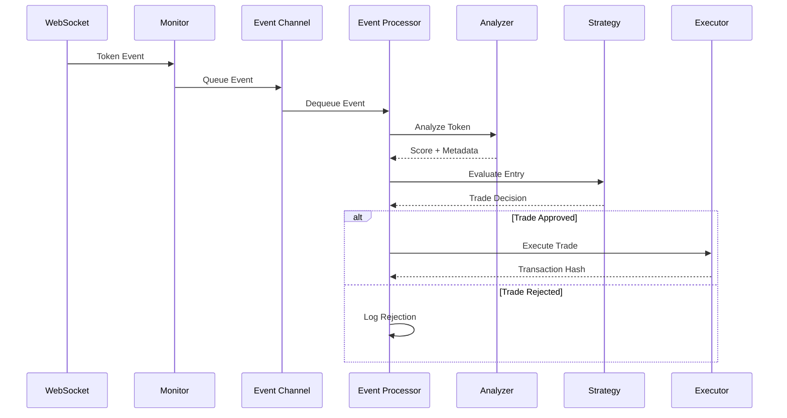

### WebSocket Message Handling

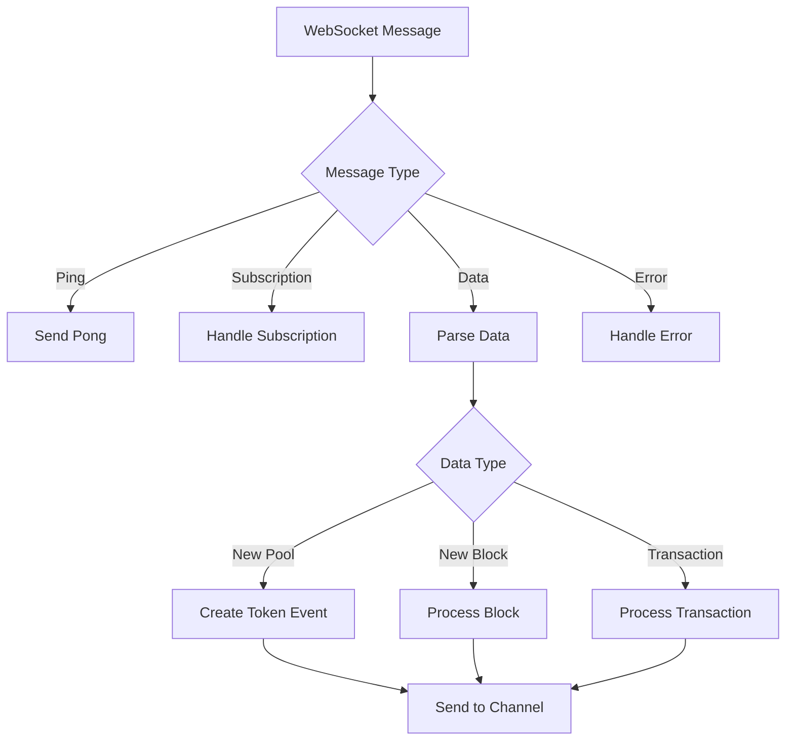

## Concurrency Model

### Goroutine Usage

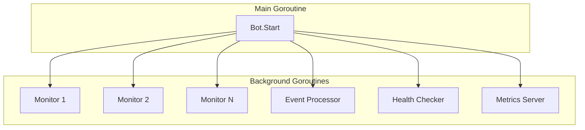

### Channel Communication

```go
// Event channel - buffered for performance
eventChan chan *TokenEvent

// Error channel - separate from events
errorChan chan error

// Shutdown coordination
shutdownCtx context.Context
shutdownCancel context.CancelFunc
```

### Synchronization

```go
// For connection state
connMu sync.RWMutex
wsConn *gws.Conn

// For metrics
statsMu sync.RWMutex
stats  Metrics

// For cache
cache sync.Map // concurrent map
```

## Error Handling

### Error Handling Strategy

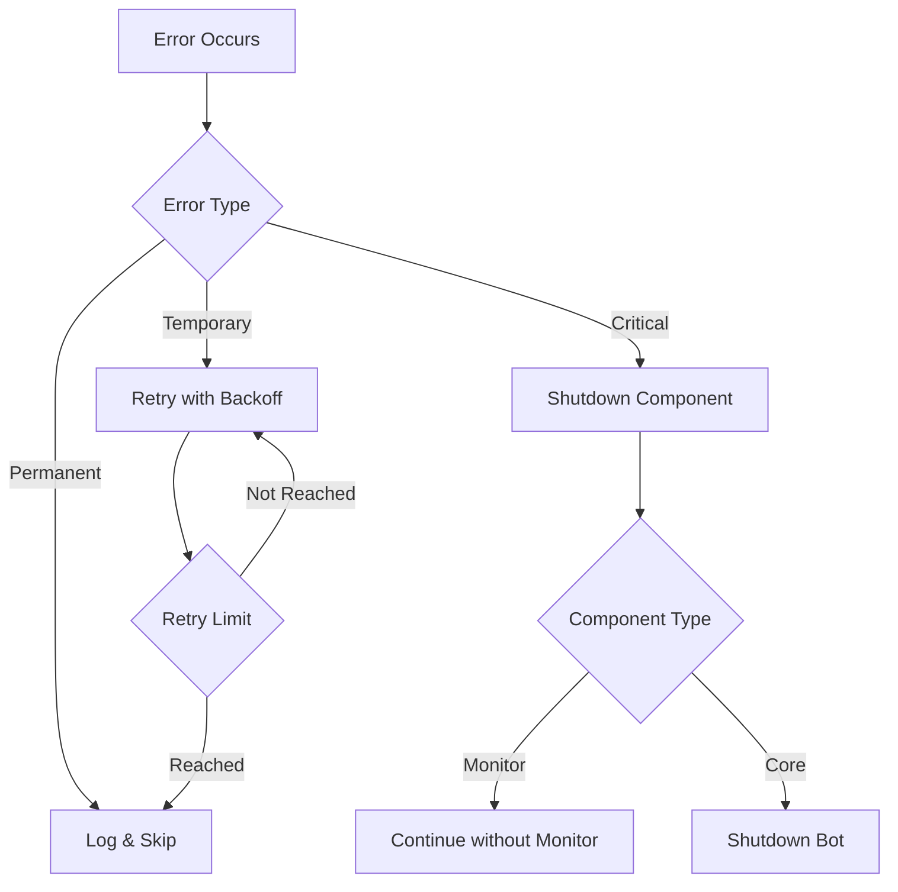

### Error Categories

| Category       | Examples                              | Handling                       |
| -------------- | ------------------------------------- | ------------------------------ |
| **Network**    | RPC timeout, WebSocket disconnect     | Retry with exponential backoff |
| **Validation** | Invalid token, insufficient liquidity | Skip token, log warning        |
| **Execution**  | Transaction failed, insufficient gas  | Log error, update metrics      |
| **Critical**   | Wallet corrupted, config invalid      | Immediate shutdown             |

### Retry Strategy

```go
// Exponential backoff with jitter
func RetryWithBackoff(
    fn func() error,
    maxAttempts int,
    initialDelay time.Duration,
    maxDelay time.Duration,
) error {
    delay := initialDelay
    for i := 0; i < maxAttempts; i++ {
        if err := fn(); err == nil {
            return nil
        }
        // Add jitter to prevent thundering herd
        jitter := time.Duration(rand.Float64() * float64(delay) * 0.1)
        time.Sleep(delay + jitter)
        delay = time.Duration(float64(delay) * 1.5)
        if delay > maxDelay {
            delay = maxDelay
        }
    }
    return ErrMaxRetriesExceeded
}
```

## Performance Considerations

### Latency Optimization

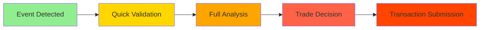

### Optimization Strategies

1. **Parallel Analysis**

   ```go
   // Run analyzers in parallel
   var wg sync.WaitGroup
   errChan := make(chan error, 3)

   wg.Add(3)
   go func() { defer wg.Done(); errChan <- a.fetchMetadata(ctx, event) }()
   go func() { defer wg.Done(); errChan <- a.analyzeSecurity(ctx, event) }()
   go func() { defer wg.Done(); errChan <- a.analyzeLiquidity(ctx, event) }()

   wg.Wait()
   ```

2. **Response Caching**

   ```go
   // Cache expensive RPC calls
   cacheKey := fmt.Sprintf("metadata:%s", mint)
   if cached, ok := cache.Load(cacheKey); ok {
       return cached.(*TokenMetadata), nil
   }
   ```

3. **Connection Pooling**
   ```go
   // Multiple RPC endpoints with load balancing
   type RPCPool struct {
       endpoints []*RPCEndpoint
       currentIndex uint32
   }
   ```

### Memory Management

```go
// Limit event channel size
eventChan := make(chan *TokenEvent, 100)

// Use bounded cache
type BoundedCache struct {
    maxEntries int
    entries    map[string]interface{}
    mu         sync.RWMutex
}

// Periodic cleanup
func (c *BoundedCache) cleanup() {
    if len(c.entries) > c.maxEntries {
        // Remove oldest entries
    }
}
```

## Security Architecture

### Wallet Security

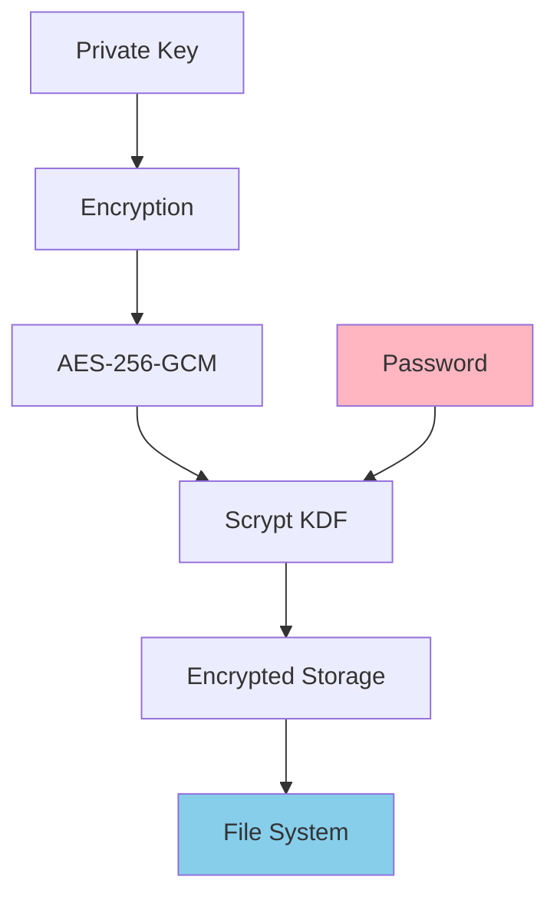

### Encryption Flow

```go
// Key derivation with scrypt
func deriveKey(password string, salt []byte) []byte {
    return scrypt.Key(
        []byte(password),
        salt,
        32768,  // N - CPU/memory cost
        8,      // r - block size
        1,      // p - parallelization
        32,     // key length
    )
}

// AES-256-GCM encryption
func encrypt(key, plaintext []byte) ([]byte, error) {
    block, err := aes.NewCipher(key)
    if err != nil {
        return nil, err
    }
    gcm, err := cipher.NewGCM(block)
    if err != nil {
        return nil, err
    }

    nonce := make([]byte, gcm.NonceSize())
    if _, err := rand.Read(nonce); err != nil {
        return nil, err
    }

    return gcm.Seal(nonce, nonce, plaintext, nil), nil
}
```

### MEV Protection

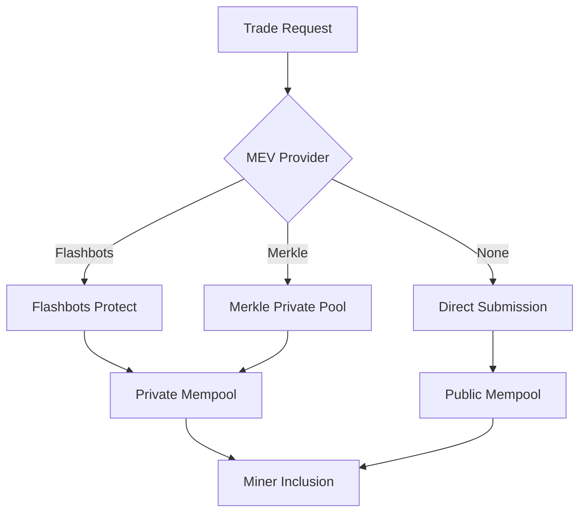

### Security Checks

| Check               | Purpose                       | Implementation             |
| ------------------- | ----------------------------- | -------------------------- |
| **Rug Pull**        | Detect liquidity removal      | Monitor pool ownership     |
| **Honeypot**        | Detect sell restrictions      | Simulate sell transaction  |
| **Tax Check**       | Detect high transaction taxes | Calculate buy/sell taxes   |
| **Liquidity Lock**  | Verify liquidity is locked    | Check lock contracts       |
| **Holder Analysis** | Detect concentrated ownership | Analyze token distribution |

## Testing Strategy

### Test Pyramid

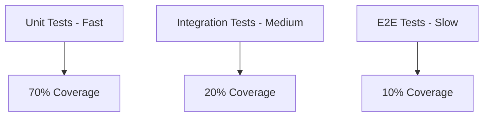

### Unit Tests

```go
func TestTokenAnalyzer_ScoreCalculation(t *testing.T) {
    analyzer := NewTokenAnalyzer(config)

    tests := []struct {
        name     string
        token    TokenMetadata
        expected float64
    }{
        {
            name: "high quality token",
            token: TokenMetadata{
                Liquidity:  decimal.NewFromFloat(100000),
                Holders:    1000,
                SocialScore: 90,
            },
            expected: 85,
        },
        // ... more test cases
    }

    for _, tt := range tests {
        t.Run(tt.name, func(t *testing.T) {
            score := analyzer.CalculateScore(tt.token)
            assert.InDelta(t, tt.expected, score, 5)
        })
    }
}
```

### Integration Tests

```go
func TestBotLifecycle(t *testing.T) {
    if testing.Short() {
        t.Skip("Skipping integration test")
    }

    bot := setupTestBot(t)
    ctx, cancel := context.WithTimeout(context.Background(), 5*time.Second)
    defer cancel()

    // Start bot
    go func() {
        if err := bot.Start(ctx); err != nil {
            t.Errorf("Start failed: %v", err)
        }
    }()

    // Wait for startup
    time.Sleep(500 * time.Millisecond)

    // Verify status
    status := bot.Status()
    assert.True(t, status.IsRunning)

    // Stop bot
    shutdownCtx, shutdownCancel := context.WithTimeout(context.Background(), 5*time.Second)
    defer shutdownCancel()
    err := bot.Stop(shutdownCtx)
    assert.NoError(t, err)
}
```

### Mock RPC Server

```go
// Mock RPC for testing
type MockRPCServer struct {
    mu     sync.Mutex
    responses map[string]interface{}
}

func (m *MockRPCServer) ServeHTTP(w http.ResponseWriter, r *http.Request) {
    var req RPCRequest
    json.NewDecoder(r.Body).Decode(&req)

    m.mu.Lock()
    response, ok := m.responses[req.Method]
    m.mu.Unlock()

    if !ok {
        w.WriteHeader(404)
        return
    }

    json.NewEncoder(w).Encode(response)
}
```

## Extension Points

### Adding a New Monitor

```go
// 1. Implement Monitor interface
type NewDEXMonitor struct {
    config   NewDEXConfig
    handler  EventHandler
    // ...
}

func (m *NewDEXMonitor) Start() error {
    // Connect to WebSocket
    // Subscribe to events
    // Handle messages
}

func (m *NewDEXMonitor) SetHandler(h EventHandler) {
    m.handler = h
}

// 2. Add factory function
func NewNewDEXMonitor(config NewDEXConfig) (*NewDEXMonitor, error) {
    return &NewDEXMonitor{config: config}, nil
}

// 3. Register in bot initialization
monitor, err := NewNewDEXMonitor(monitorConfig)
monitors = append(monitors, monitor)
```

### Adding a New Analyzer

```go
// 1. Define analyzer interface
type CustomAnalyzer interface {
    Analyze(ctx context.Context, event TokenEvent) (CustomResult, error)
}

// 2. Implement analyzer
type MyAnalyzer struct {
    config MyAnalyzerConfig
}

func (a *MyAnalyzer) Analyze(ctx context.Context, event TokenEvent) (CustomResult, error) {
    // Custom analysis logic
    return CustomResult{}, nil
}

// 3. Integrate into analysis pipeline
result, err := myAnalyzer.Analyze(ctx, event)
score := calculateScore(result)
```

### Adding a New Chain

```go
// 1. Define chain types
const ChainTypeNewChain = "newchain"

// 2. Implement chain-specific trader
type NewChainTrader struct {
    config NewChainConfig
}

func (t *NewChainTrader) ExecuteSwap(ctx context.Context, params SwapParams) (*SwapResult, error) {
    // Chain-specific swap logic
    return &SwapResult{}, nil
}

// 3. Add chain configuration
chains:
  newchain:
    enabled: true
    network: mainnet
    rpc_endpoints:
      - url: https://newchain-rpc.com
```

## Monitoring and Observability

### Metrics Collected

```go
// Trade metrics
TradesTotal        *prometheus.CounterVec
TradesSuccess      *prometheus.CounterVec
TradesFailed       *prometheus.CounterVec
TradeAmount        *prometheus.HistogramVec
TradeDuration      *prometheus.HistogramVec

// Monitoring metrics
EventsDetected     *prometheus.CounterVec
EventsProcessed    *prometheus.CounterVec
MonitorStatus      *prometheus.GaugeVec

// System metrics
BotUptime          prometheus.Gauge
ErrorsTotal        *prometheus.CounterVec
RPCRequests        *prometheus.CounterVec
RPCLatency         *prometheus.HistogramVec
```

### Health Checks

```go
type HealthStatus struct {
    Status      string            `json:"status"`
    Version     string            `json:"version"`
    Uptime      time.Duration     `json:"uptime"`
    Monitors    []MonitorHealth   `json:"monitors"`
    Wallets     []WalletHealth    `json:"wallets"`
}

func (b *Bot) HealthCheck() HealthStatus {
    return HealthStatus{
        Status: "healthy",
        // ...
    }
}
```

---

For more details, see:

- [Quick Start Guide](QUICKSTART.md)
- [Main README](../README.md)
- [API Documentation](API.md)
