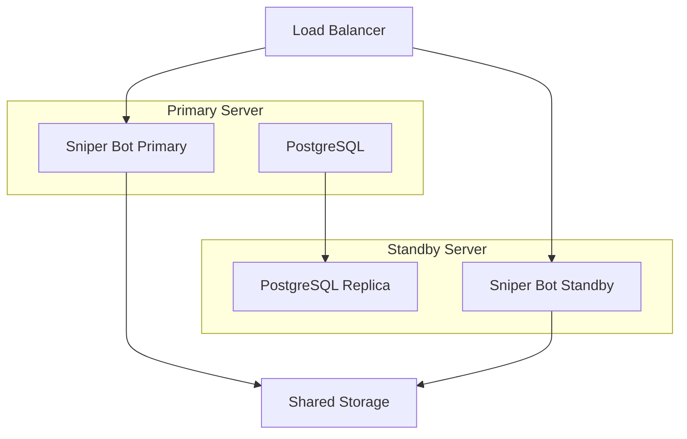

# Deployment Guide

Production deployment guide for the meme coin sniper bot.

## Table of Contents

- [Pre-Deployment Checklist](#pre-deployment-checklist)
- [Deployment Options](#deployment-options)
- [Production Configuration](#production-configuration)
- [Monitoring and Logging](#monitoring-and-logging)
- [Scaling Considerations](#scaling-considerations)
- [Disaster Recovery](#disaster-recovery)

## Pre-Deployment Checklist

### Security Checklist

- [ ] Wallet encryption enabled
- [ ] Strong password set (16+ characters, mixed case, numbers, symbols)
- [ ] API keys stored in environment variables
- [ ] Config file permissions set to 600
- [ ] Firewall rules configured
- [ ] SSH keys secured
- [ ] Backup strategy in place

### Configuration Checklist

- [ ] RPC endpoints tested for reliability
- [ ] Strategy parameters backtested
- [ ] Risk limits defined
- [ ] Alert channels configured
- [ ] Logging level appropriate
- [ ] Dry-run mode tested first

### Infrastructure Checklist

- [ ] Sufficient resources allocated (CPU, RAM, storage)
- [ ] Network connectivity verified
- [ ] Time synchronization enabled
- [ ] Log rotation configured
- [ ] Monitoring endpoints accessible
- [ ] Backup automation set up

## Deployment Options

### Option 1: Docker Compose (Recommended for Single Server)

#### Directory Structure

```
/opt/meme-sniper/
├── config.yaml
├── .env
├── docker-compose.yml
├── wallets/
│   └── encrypted/
├── logs/
└── data/
```

#### docker-compose.yml

```yaml
version: '3.8'

services:
  sniper:
    image: meme-sniper:latest
    container_name: meme-sniper
    restart: unless-stopped
    environment:
      - SNIPER_DRY_RUN=${DRY_RUN:-false}
      - WALLET_PASSWORD=${WALLET_PASSWORD}
      - SOLANA_RPC_URL=${SOLANA_RPC_URL}
      - FLASHBOTS_API_KEY=${FLASHBOTS_API_KEY:-}
    volumes:
      - ./config.yaml:/app/config.yaml:ro
      - ./wallets:/app/wallets
      - ./logs:/app/logs
      - ./data:/app/data
    ports:
      - "9090:9090"  # Metrics
    logging:
      driver: json-file
      options:
        max-size: "10m"
        max-file: "3"
    healthcheck:
      test: ["CMD", "sniper", "status"]
      interval: 30s
      timeout: 10s
      retries: 3
      start_period: 40s

  prometheus:
    image: prom/prometheus:latest
    container_name: prometheus
    restart: unless-stopped
    volumes:
      - ./prometheus.yml:/etc/prometheus/prometheus.yml:ro
      - prometheus-data:/prometheus
    ports:
      - "9091:9090"
    command:
      - '--config.file=/etc/prometheus/prometheus.yml'
      - '--storage.tsdb.path=/prometheus'
      - '--web.console.libraries=/usr/share/prometheus/console_libraries'
      - '--web.console.templates=/usr/share/prometheus/consoles'

  grafana:
    image: grafana/grafana:latest
    container_name: grafana
    restart: unless-stopped
    volumes:
      - grafana-data:/var/lib/grafana
    environment:
      - GF_SECURITY_ADMIN_PASSWORD=${GRAFANA_PASSWORD:-admin}
      - GF_USERS_ALLOW_SIGN_UP=false
    ports:
      - "3000:3000"
    depends_on:
      - prometheus

volumes:
  prometheus-data:
  grafana-data:
```

#### prometheus.yml

```yaml
global:
  scrape_interval: 15s
  evaluation_interval: 15s

scrape_configs:
  - job_name: 'meme-sniper'
    static_configs:
      - targets: ['sniper:9090']
```

#### .env

```bash
# Security
WALLET_PASSWORD=your_secure_password_here
GRAFANA_PASSWORD=your_grafana_password

# Bot Configuration
DRY_RUN=false
LOG_LEVEL=info

# RPC Endpoints
SOLANA_RPC_URL=https://your-rpc.com
BASE_RPC_URL=https://your-base-rpc.com

# API Keys
FLASHBOTS_API_KEY=your_flashbots_key
JUPITER_API_KEY=your_jupiter_key
```

#### Deployment Commands

```bash
# 1. Create directory structure
sudo mkdir -p /opt/meme-sniper/{wallets,logs,data}
cd /opt/meme-sniper

# 2. Copy files
sudo cp /path/to/docker-compose.yml .
sudo cp /path/to/config.yaml .
sudo cp /path/to/.env .

# 3. Set permissions
sudo chmod 600 config.yaml
sudo chmod 600 .env
sudo chmod 700 wallets

# 4. Build and start
docker-compose pull
docker-compose up -d

# 5. Check status
docker-compose ps
docker-compose logs -f sniper
```

### Option 2: Kubernetes (Production Grade)

#### Namespace

```yaml
# namespace.yaml
apiVersion: v1
kind: Namespace
metadata:
  name: meme-sniper
```

#### ConfigMap

```yaml
# configmap.yaml
apiVersion: v1
kind: ConfigMap
metadata:
  name: sniper-config
  namespace: meme-sniper
data:
  config.yaml: |
    # Your configuration here
    bot:
      name: production-sniper
      dry_run: false
    # ... rest of config
```

#### Secrets

```yaml
# secrets.yaml
apiVersion: v1
kind: Secret
metadata:
  name: wallet-secrets
  namespace: meme-sniper
type: Opaque
stringData:
  password: your_secure_password
---
apiVersion: v1
kind: Secret
metadata:
  name: api-secrets
  namespace: meme-sniper
type: Opaque
stringData:
  flashbots-key: your_flashbots_key
  jupiter-key: your_jupiter_key
```

#### Deployment

```yaml
# deployment.yaml
apiVersion: apps/v1
kind: Deployment
metadata:
  name: sniper-bot
  namespace: meme-sniper
spec:
  replicas: 1
  selector:
    matchLabels:
      app: sniper-bot
  template:
    metadata:
      labels:
        app: sniper-bot
    spec:
      containers:
      - name: sniper
        image: meme-sniper:latest
        imagePullPolicy: Always
        env:
        - name: WALLET_PASSWORD
          valueFrom:
            secretKeyRef:
              name: wallet-secrets
              key: password
        - name: FLASHBOTS_API_KEY
          valueFrom:
            secretKeyRef:
              name: api-secrets
              key: flashbots-key
        ports:
        - containerPort: 9090
          name: metrics
        volumeMounts:
        - name: config
          mountPath: /app/config.yaml
          subPath: config.yaml
        - name: wallets
          mountPath: /app/wallets
        resources:
          requests:
            cpu: 500m
            memory: 512Mi
          limits:
            cpu: 2000m
            memory: 2Gi
        livenessProbe:
          httpGet:
            path: /metrics
            port: metrics
          initialDelaySeconds: 30
          periodSeconds: 10
        readinessProbe:
          httpGet:
            path: /metrics
            port: metrics
          initialDelaySeconds: 10
          periodSeconds: 5
      volumes:
      - name: config
        configMap:
          name: sniper-config
      - name: wallets
        persistentVolumeClaim:
          claimName: wallet-storage
```

#### Persistent Volume

```yaml
# pvc.yaml
apiVersion: v1
kind: PersistentVolumeClaim
metadata:
  name: wallet-storage
  namespace: meme-sniper
spec:
  accessModes:
    - ReadWriteOnce
  resources:
    requests:
      storage: 10Gi
  storageClassName: fast-ssd
```

#### Service

```yaml
# service.yaml
apiVersion: v1
kind: Service
metadata:
  name: sniper-metrics
  namespace: meme-sniper
spec:
  selector:
    app: sniper-bot
  ports:
  - port: 9090
    targetPort: 9090
    name: metrics
```

#### Deploy Commands

```bash
# Apply all manifests
kubectl apply -f namespace.yaml
kubectl apply -f secrets.yaml
kubectl apply -f configmap.yaml
kubectl apply -f pvc.yaml
kubectl apply -f deployment.yaml
kubectl apply -f service.yaml

# Check status
kubectl get pods -n meme-sniper
kubectl logs -f deployment/sniper-bot -n meme-sniper
```

### Option 3: Systemd Service (Simple Linux Server)

```bash
# 1. Install binary
sudo cp bin/sniper /usr/local/bin/
sudo chmod +x /usr/local/bin/sniper

# 2. Create directories
sudo mkdir -p /opt/meme-sniper/{wallets,logs}
sudo chown $USER:$USER /opt/meme-sniper

# 3. Copy config
cp config.yaml /opt/meme-sniper/
chmod 600 /opt/meme-sniper/config.yaml

# 4. Create service file
sudo tee /etc/systemd/system/sniper.service > /dev/null <<EOF
[Unit]
Description=Meme Coin Sniper Bot
After=network-online.target
Wants=network-online.target

[Service]
Type=simple
User=$USER
WorkingDirectory=/opt/meme-sniper
ExecStart=/usr/local/bin/sniper start --config /opt/meme-sniper/config.yaml
Restart=always
RestartSec=10
StandardOutput=append:/opt/meme-sniper/logs/sniper.log
StandardError=append:/opt/meme-sniper/logs/sniper-error.log

# Security
NoNewPrivileges=true
PrivateTmp=true
ProtectSystem=strict
ReadWritePaths=/opt/meme-sniper

[Install]
WantedBy=multi-user.target
EOF

# 5. Enable and start
sudo systemctl daemon-reload
sudo systemctl enable sniper
sudo systemctl start sniper

# 6. Check status
sudo systemctl status sniper
journalctl -u sniper -f
```

## Production Configuration

### Recommended Settings

```yaml
# Bot Settings
bot:
  name: production-sniper
  dry_run: false  # IMPORTANT: Set to false for live trading
  log_level: info  # Use debug for troubleshooting
  max_concurrent_trades: 3

# Chain Settings
chains:
  solana:
    enabled: true
    network: mainnet
    rpc_endpoints:
      - url: ${SOLANA_RPC_URL}
        name: primary
        weight: 100
      - url: ${SOLANA_RPC_URL_BACKUP}
        name: backup
        weight: 50

# Monitoring
monitoring:
  solana:
    pumpfun:
      enabled: true
      reconnect_delay: 5s
    raydium:
      enabled: true
    orca:
      enabled: false  # Disable if not needed
  connection_timeout: 10s
  max_retries: 5

# Analysis (Conservative)
analysis:
  min_liquidity_usd: 10000
  min_score: 80
  check_rug_pull: true
  check_honeypot: true
  max_buy_tax: 3
  max_sell_tax: 3
  cache_ttl: 300s

# Strategy (Conservative)
strategies:
  mode: auto
  max_position_size_usd: 100
  max_daily_trades: 20
  take_profit_percent: 50
  stop_loss_percent: 20
  trailing_stop_percent: 10

# Risk Management
risk:
  max_daily_loss_usd: 500
  max_open_positions: 5
  cooldown_period: 300s
```

### Logging Configuration

```yaml
# For JSON structured logging (recommended for production)
logger:
  format: json
  level: info
  output: stdout
  # Or for file logging
  # output: /opt/meme-sniper/logs/sniper.log

# For human-readable logging (development)
logger:
  format: console
  level: debug
```

### Log Rotation

```bash
# /etc/logrotate.d/meme-sniper
/opt/meme-sniper/logs/*.log {
    daily
    rotate 14
    compress
    delaycompress
    notifempty
    create 0640 $USER $USER
    sharedscripts
    postrotate
        systemctl reload sniper > /dev/null 2>&1 || true
    endscript
}
```

## Monitoring and Logging

### Prometheus Metrics

Access metrics at `http://your-server:9090/metrics`

Key metrics to monitor:

```promql
# Trade success rate
rate(sniper_trades_success_total[5m]) / rate(sniper_trades_total[5m])

# Error rate
rate(sniper_errors_total[5m])

# Monitor uptime
sniper_monitor_up{name="pumpfun",chain="solana"}

# Average trade duration
rate(sniper_trade_duration_seconds_sum[5m]) / rate(sniper_trade_duration_seconds_count[5m])
```

### Grafana Dashboards

Import dashboard from `grafana-dashboard.json`:

1. Open Grafana
2. Go to Dashboards → Import
3. Upload `grafana-dashboard.json`
4. Select Prometheus data source

### Alerting Rules

```yaml
# alerting_rules.yml
groups:
  - name: sniper_alerts
    interval: 30s
    rules:
      - alert: HighErrorRate
        expr: rate(sniper_errors_total[5m]) > 0.1
        for: 5m
        labels:
          severity: warning
        annotations:
          summary: "High error rate detected"
          description: "Error rate is {{ $value }} errors/sec"

      - alert: MonitorDown
        expr: sniper_monitor_up == 0
        for: 2m
        labels:
          severity: critical
        annotations:
          summary: "Monitor is down"
          description: "Monitor {{ $labels.name }} on {{ $labels.chain }} is down"

      - alert: HighFailureRate
        expr: |
          rate(sniper_trades_failed_total[5m]) /
          rate(sniper_trades_total[5m]) > 0.3
        for: 10m
        labels:
          severity: warning
        annotations:
          summary: "High trade failure rate"
          description: "{{ $value | humanizePercentage }} of trades are failing"
```

### Alertmanager Configuration

```yaml
# alertmanager.yml
global:
  resolve_timeout: 5m

route:
  group_by: ['alertname', 'cluster', 'service']
  group_wait: 10s
  group_interval: 10s
  repeat_interval: 12h
  receiver: 'default'

receivers:
  - name: 'default'
    webhook_configs:
      - url: https://your-webhook-url
    email_configs:
      - to: your-email@example.com
        from: alertmanager@example.com
        smarthost: smtp.example.com:587
```

## Scaling Considerations

### Horizontal Scaling

The bot is designed to run as a single instance. For scaling:

1. **Multiple Independent Bots**
   ```yaml
   # Run multiple bots with different strategies
   bot-1: # Conservative
     strategies:
       max_position_size_usd: 50

   bot-2: # Aggressive
     strategies:
       max_position_size_usd: 200
   ```

2. **Chain Separation**
   ```bash
   # Separate instances for each chain
   sniper-solana --config solana.yaml
   sniper-base --config base.yaml
   ```

### Vertical Scaling

| Component | CPU | RAM | Storage |
|-----------|-----|-----|---------|
| **Minimum** | 1 core | 512 MB | 20 GB |
| **Recommended** | 2-4 cores | 2-4 GB | 50 GB SSD |
| **High Performance** | 8+ cores | 8+ GB | 100 GB NVMe |

### Network Optimization

```yaml
# Use multiple RPC endpoints for load balancing
rpc_endpoints:
  - url: rpc-1.example.com
    weight: 100
    region: us-east
  - url: rpc-2.example.com
    weight: 100
    region: us-west
  - url: rpc-3.example.com
    weight: 50
    region: eu-west
```

## Disaster Recovery

### Backup Strategy

```bash
#!/bin/bash
# backup.sh - Daily backup script

BACKUP_DIR="/backups/meme-sniper"
DATE=$(date +%Y%m%d)
CONFIG_FILE="/opt/meme-sniper/config.yaml"
WALLET_DIR="/opt/meme-sniper/wallets"

# Create backup directory
mkdir -p "$BACKUP_DIR/$DATE"

# Backup config
cp $CONFIG_FILE "$BACKUP_DIR/$DATE/"

# Backup wallets (encrypted)
tar -czf "$BACKUP_DIR/$DATE/wallets.tar.gz" -C $WALLET_DIR .

# Backup logs (last 7 days)
find /opt/meme-sniper/logs -name "*.log" -mtime -7 -exec cp {} "$BACKUP_DIR/$DATE/" \;

# Upload to S3 (optional)
aws s3 sync "$BACKUP_DIR/$DATE" s3://your-backup-bucket/meme-sniper/$DATE/

# Clean old backups (keep 30 days)
find "$BACKUP_DIR" -type d -mtime +30 -exec rm -rf {} +
```

### Restore Procedure

```bash
#!/bin/bash
# restore.sh - Restore from backup

BACKUP_DATE=$1  # Format: YYYYMMDD
BACKUP_DIR="/backups/meme-sniper"
RESTORE_DIR="/opt/meme-sniper"

# Stop bot
systemctl stop sniper

# Restore config
cp "$BACKUP_DIR/$BACKUP_DATE/config.yaml" "$RESTORE_DIR/"

# Restore wallets
tar -xzf "$BACKUP_DIR/$BACKUP_DATE/wallets.tar.gz" -C "$RESTORE_DIR/wallets"

# Restart bot
systemctl start sniper

# Verify
systemctl status sniper
```

### High Availability Setup



## Security Hardening

### Firewall Configuration

```bash
# UFW rules
sudo ufw default deny incoming
sudo ufw default allow outgoing

# Allow SSH
sudo ufw allow 22/tcp

# Allow metrics (if needed)
sudo ufw allow 9090/tcp

# Enable firewall
sudo ufw enable
```

### Fail2Ban Configuration

```ini
# /etc/fail2ban/jail.local
[sniper-auth]
enabled = true
port = http,https
filter = sniper-auth
logpath = /opt/meme-sniper/logs/sniper-error.log
maxretry = 5
bantime = 3600
findtime = 600
```

### Security Updates

```bash
# Auto-update security patches
sudo apt install unattended-upgrades
sudo dpkg-reconfigure -plow unattended-upgrades
```

## Performance Tuning

### Go Runtime Options

```bash
# Environment variables for Go runtime
export GOGC=100  # GC trigger percentage
export GOMAXPROCS=4  # Max CPU cores
export GODEBUG=gctrace=1  # GC tracing (for debugging)
```

### System Optimization

```bash
# /etc/sysctl.conf
# Network optimization
net.core.rmem_max = 134217728
net.core.wmem_max = 134217728
net.ipv4.tcp_rmem = 4096 87380 67108864
net.ipv4.tcp_wmem = 4096 65536 67108864

# Apply changes
sudo sysctl -p
```

## Troubleshooting Production Issues

### Common Issues and Solutions

| Issue | Symptoms | Solution |
|-------|----------|----------|
| **High Memory** | OOM kills | Reduce event buffer size, disable unused monitors |
| **High CPU** | Slow response | Increase polling intervals, reduce concurrent trades |
| **Connection Drops** | Frequent reconnects | Check RPC endpoint health, add backup RPCs |
| **Failed Trades** | Low success rate | Increase slippage, check gas fees |
| **Stuck Transactions** | Pending forever | Check node status, increase priority fees |

### Diagnostic Commands

```bash
# Check bot status
systemctl status sniper

# View recent logs
journalctl -u sniper -n 100

# Follow logs in real-time
journalctl -u sniper -f

# Check resource usage
top -p $(pgrep sniper)

# Check network connections
netstat -an | grep ESTABLISHED | grep sniper

# Check disk usage
du -sh /opt/meme-sniper/*

# Check for errors in logs
grep -i error /opt/meme-sniper/logs/sniper.log | tail -50
```

---

For additional information:
- [Quick Start Guide](QUICKSTART.md)
- [Architecture Documentation](ARCHITECTURE.md)
- [Main README](../README.md)
